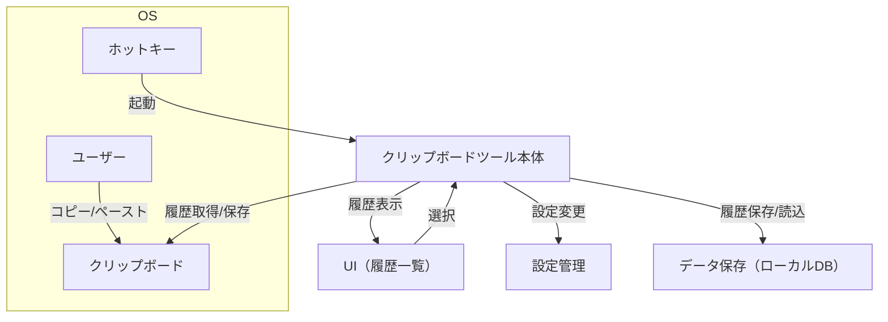

# クリップボード管理ツール設計書

## 1. 概要

本ツールは、Windows の「Windows + V」で起動するクリップボード履歴機能のように、複数のプラットフォーム（Windows, macOS, Linux）で動作するクリップボード管理ツールです。ユーザーはホットキー（例：Windows + V, Cmd + Shift + V など）でツールを呼び出し、過去にコピーしたテキストや画像などを一覧から選択して再度貼り付けることができます。

---

## 2. 要件

### 2.1 機能要件

- クリップボード履歴の自動保存（テキスト、画像、ファイルパスなど）
- ホットキーでのツール起動（プラットフォームごとにカスタマイズ可能）
- 履歴の一覧表示（最新順、検索機能付き）
- 履歴から選択してクリップボードへ再コピー
- 履歴の削除・ピン留め（お気に入り）
- 設定画面（履歴保存数、起動ホットキー、保存対象の種類など）
- マルチプラットフォーム対応（Windows, macOS, Linux）

### 2.2 非機能要件

- 軽量かつ高速な動作
- セキュリティ（クリップボードデータの暗号化保存、外部送信なし）
- UI/UX の統一感
- 自動起動（OS 起動時にバックグラウンドで常駐）

---

## 3. システム構成

---

## 4. 技術選定

- フレームワーク：Tauri + React（Electron より軽量、マルチプラットフォーム対応）
- バックエンド：Rust（Tauri のバックエンド）
- フロントエンド：React（TypeScript）
- データ保存：ローカル DB（SQLite）
- ホットキー管理：Tauri の API または各 OS のネイティブ API

---

## 5. 画面設計（例）

- 履歴一覧画面
  - 検索バー
  - 履歴リスト（テキスト/画像のサムネイル、ピン留めアイコン、削除ボタン）
- 設定画面
  - ホットキー設定
  - 保存件数設定
  - 保存対象の種類選択

---
